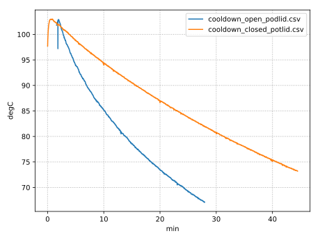
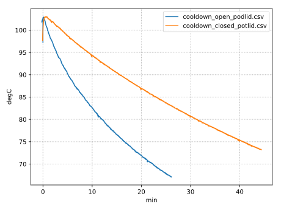

# peaktech_4390.py

Simple command line tool to log data from PeakTech 4390 multimeter.
The output is in CSV format containing a timestamp, the measured value and the physical units.

## Examples

simple use (stdout only):

```bash
>./peaktech_4390.py
0.1056, s, 24.1, degC
0.6216, s, 24.1, degC
1.1374, s, 24.1, degC
1.6533, s, 24.1, degC
...
```

using a different device and log to file:

```bash
>./peaktech_4390.py --device=/dev/ttyUSB2 | tee log.csv
0.1056, s, 24.1, degC
0.6216, s, 24.1, degC
1.1374, s, 24.1, degC
1.6533, s, 24.1, degC
...
```

# peaktech_4390_diagram.py

This tool can use the data, generated from peaktech_4390.py and generate simple diagrams
from it by using matplotlib.

## Examples

Show a diagram from a log file

```bash
>./peaktech_4390_diagram.py log.csv
```

Find all *.csv file in a directory, process them and export the diagram to a file

```bash
>find watercooker/ -name "*.csv" | xargs ./peaktech_4390_diagram.py --output watercooker/graph_nonzero.svg
```



With multiple data logs it is possible to adjust the time offset (x axis).
It can be done by specifying a zero-align parameter.
With this the x axis zero is shifted for every data log to where the y axis values crosses the zero-align value first.

```bash
>find watercooker/ -name "*.csv" | xargs ./peaktech_4390_diagram.py --output watercooker/graph_zeroalign.svg --zero-align 100
```


